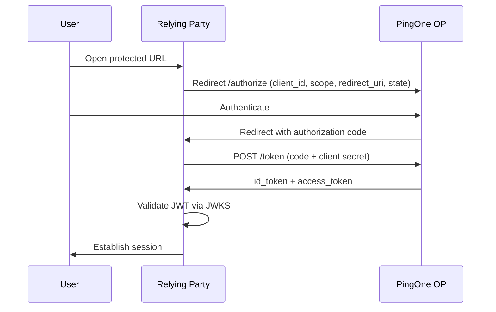

# OIDC basics

| Field | Value |
|-------|-------|
| Status | stable |
| Audience | engineers |
| Level | intro |
| Last reviewed | 2026-07-24 |
| Owner | YankiDev |

**Copyright © 2026 YankiDev ([yankidev.com](https://yankidev.com))**

## What OIDC adds on top of OAuth 2.0

| OAuth 2.0 | OpenID Connect |
|-----------|----------------|
| Authorization for APIs | Authentication of the end user |
| Access token | **ID Token** (JWT) + optional UserInfo |
| Resource owner consent | Standardized identity claims (`sub`, `email`, …) |

PingOne acts as the **OpenID Provider (OP)**. Your app is the **Relying Party (RP)** / OAuth client.

## Key endpoints (from discovery)

Fetch:

```http
GET https://auth.pingone.com/{env-id}/as/.well-known/openid-configuration
```

Typical fields:

| Discovery field | Purpose |
|-----------------|---------|
| `issuer` | Must match `iss` claim in tokens |
| `authorization_endpoint` | Browser redirect to login |
| `token_endpoint` | Exchange code / client credentials |
| `userinfo_endpoint` | Optional profile claims |
| `jwks_uri` | Public keys to verify JWT signatures |
| `end_session_endpoint` | RP-initiated logout |

## Tokens you will see

| Token | Audience | Use |
|-------|----------|-----|
| **ID Token** | Your client (`aud` = client_id) | Prove who logged in; create app session |
| **Access Token** | APIs / resource servers | Call protected APIs (including PingOne APIs when scoped) |
| **Refresh Token** | Token endpoint | Obtain new access/ID tokens without login (if issued) |

## Authorization Code flow (web apps) — step by step

1. User hits a protected page → app redirects to PingOne `authorization_endpoint`.
2. User authenticates (and MFA if required).
3. PingOne redirects to your **redirect URI** with `?code=...&state=...`.
4. App POSTs to `token_endpoint` with `code`, `client_id`, `client_secret` (confidential), and `redirect_uri`.
5. App receives tokens, validates ID Token signature via JWKS, maps `sub` to a local principal.
6. Optional: call `userinfo_endpoint` with the access token.

### Sequence (teaching diagram)



## Scopes that matter

| Scope | Effect |
|-------|--------|
| `openid` | Required for OIDC; enables ID Token |
| `profile` | Name and profile claims |
| `email` | Email claims |

Always request `openid` for login. Add more scopes only when needed.

## Next

- [Web App Authorization Code](authorization-code-web-app.md)
- [SPA & Native PKCE](spa-native-pkce.md)
