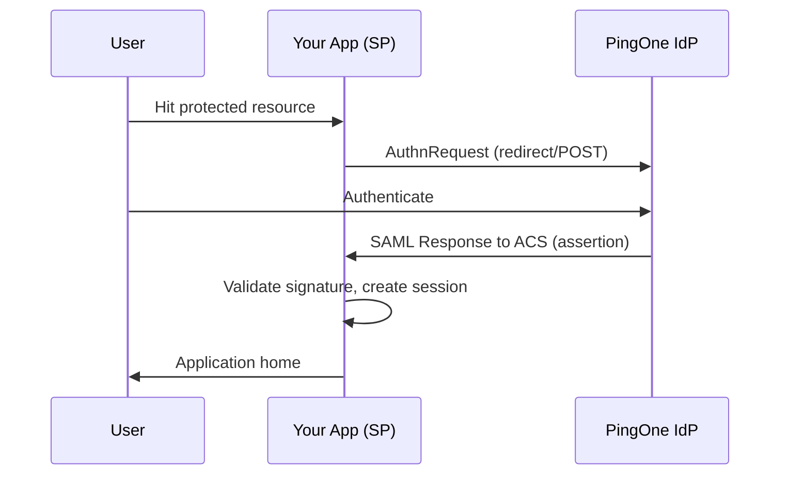

# SAML basics

| Field | Value |
|-------|-------|
| Status | stable |
| Audience | engineers |
| Level | intro |
| Last reviewed | 2026-07-24 |
| Owner | YankiDev |

**Copyright © 2026 YankiDev ([yankidev.com](https://yankidev.com))**

## Actors

| Role | In this integration |
|------|---------------------|
| **IdP** | PingOne |
| **SP** | Your application |
| **Assertion** | Signed XML statement about the authenticated user |
| **ACS** | SP URL that receives the assertion via HTTP-POST |

## SP-initiated SSO flow



Typical Spring path to start login:

```text
GET /saml2/authenticate/{registrationId}
```

ACS example:

```text
https://app.example.com/login/saml2/sso/pingone
```

## Metadata

| Artifact | Example |
|----------|---------|
| PingOne IdP metadata | `https://auth.pingone.com/{env-id}/saml20/metadata` |
| SP Entity ID | `https://app.example.com/saml/metadata` |
| ACS location | `https://app.example.com/login/saml2/sso/pingone` |

Import IdP metadata into the SP; register SP entity ID + ACS in PingOne Admin.

## Attributes

Assertions carry attributes (email, groups, employee id, …). Map them to your app’s user model — same idea as OIDC claims, different wire format.

## Next

- [Spring Boot SAML examples](spring-boot-examples.md)
